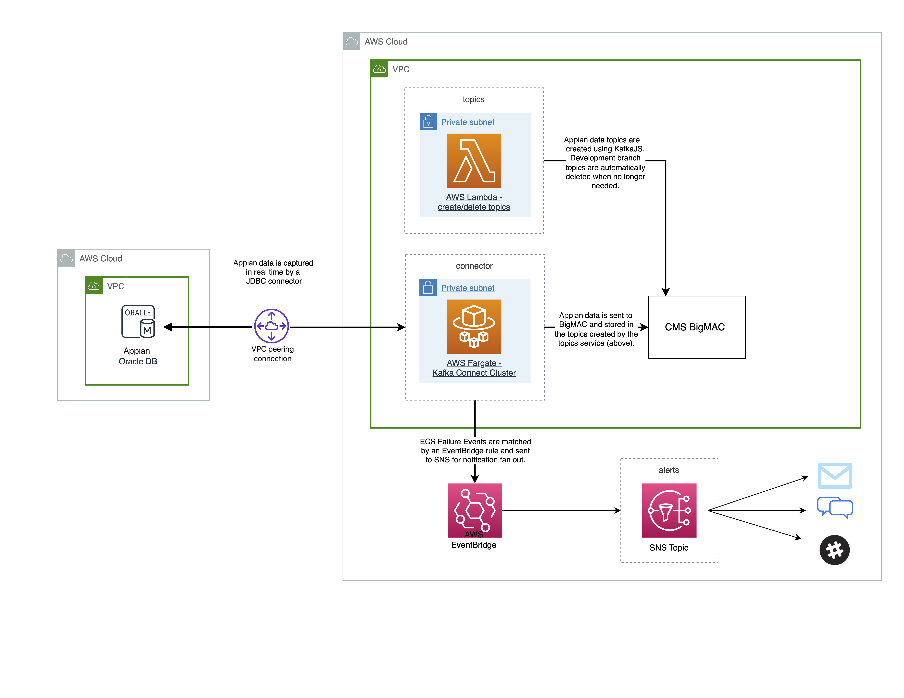

<h1 align="center" style="border-bottom: none;">macpro-appian-connector</h1>
<h3 align="center">A Kafka Connector to stream data changes from Appian to BigMAC.</h3>
<p align="center">
  <a href="https://github.com/Enterprise-CMCS/macpro-appian-connector/wiki">
    
  </a>
  <a href="https://cmsgov.slack.com/archives/C04K1444K89">
    
  </a>
  <a href="https://codeclimate.com/github/Enterprise-CMCS/macpro-appian-connector/maintainability">
    
  </a>
  <a href="https://dependabot.com/">
    
  </a>
  <a href="https://github.com/prettier/prettier">
    
  </a>
  <a href="https://github.com/semantic-release/semantic-release">
    
  </a>
</p>

---

### Documentation: [Wiki](https://github.com/Enterprise-CMCS/macpro-appian-connector/wiki) | [CDK Migration Guide](docs/CDK-MIGRATION.md)

---

## Overview

A Kafka Connector to stream data changes from Appian to BigMAC.

<p align="center">
  
</p>

## Technology Stack

- **Infrastructure as Code**: AWS CDK (TypeScript)
- **Runtime**: Node.js 20.x, TypeScript
- **AWS Services**: ECS Fargate, Lambda, SNS, KMS, CloudWatch
- **Streaming**: Apache Kafka, Kafka Connect

## Quick Start

```bash
# Install dependencies
yarn install

# Deploy to master
run deploy --stage master

# Or deploy directly with CDK
cd infra
yarn build
npx cdk deploy appian-alerts-master appian-connector-master
```

## Project Structure

```
macpro-appian-connector/
├── infra/                    # AWS CDK infrastructure
│   ├── bin/                  # CDK app entry point
│   └── lib/                  # Stack definitions
├── src/
│   ├── types/                # Shared TypeScript types
│   ├── libs/                 # Shared libraries
│   └── services/
│       └── connector/
│           ├── handlers/     # Lambda handlers (TypeScript)
│           └── libs/         # Connector-specific libraries
└── docs/                     # Documentation site
```

## Contributing

Work items for this project are tracked in Jira. Check out the [project kanban board](https://qmacbis.atlassian.net/jira/software/c/projects/OY2/boards/240) to view all work items affecting this repo.

If you don't have access to Jira, would like access to Jira, or would like to drop us an idea without pursuing Jira access, please visit the [slack channel](https://cmsgov.slack.com/archives/C04K1444K89).

## License

[](https://creativecommons.org/publicdomain/zero/1.0/legalcode)

See [LICENSE](LICENSE) for full details.
