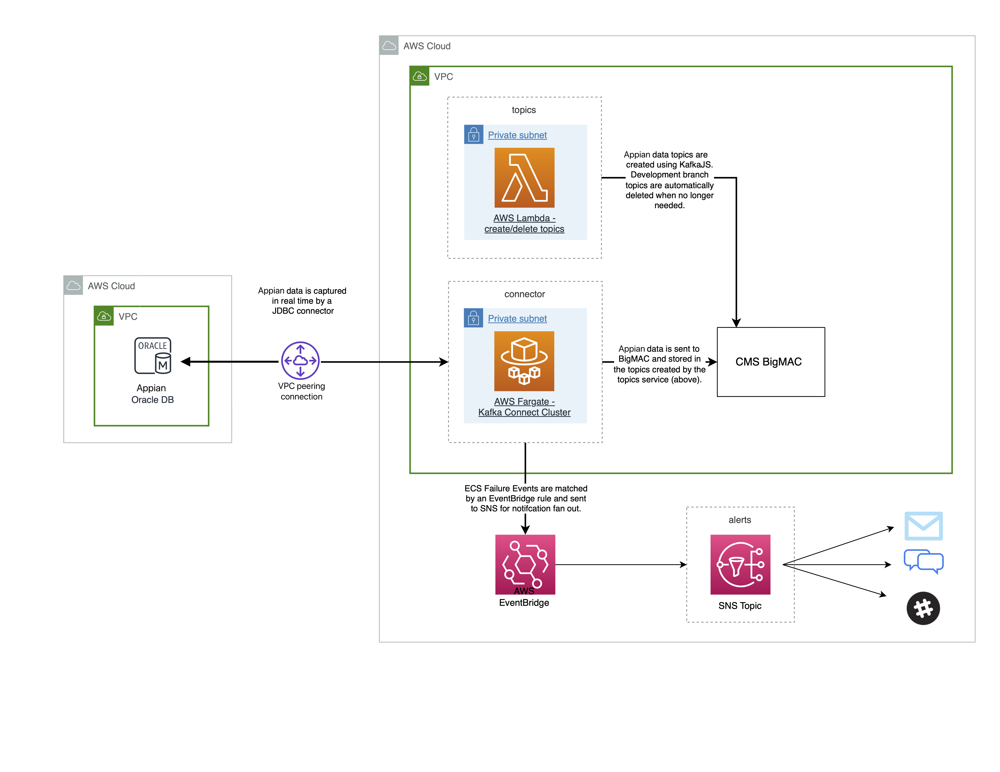

## Overview

{: .no_toc }

The 10,000ft view
{: .fs-6 .fw-300 }

## Table of contents

{: .no_toc .text-delta }

1. TOC
{:toc}

---

## Overview

The {{ site.repo.name }} project is a Kafka Connector to stream data changes from Appian to BigMAC.

## Architecture

A diagram is often the best way to communicate the architecture:

